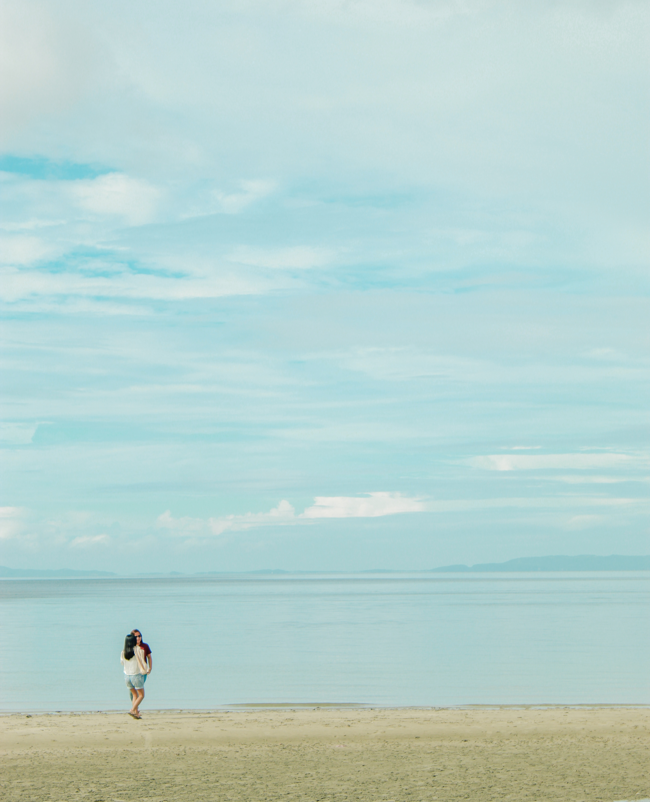

## TODO 

add breakpoints css
add reset scss

---------------------------------------------

$breakpoints: (
  'phone-small': 360px,
  'phone': 375px,
  'phone-large': 414px,
  'tablet': 768px,
  'desktop-small': 1280px,
  'desktop': 1366px,
  'desktop-large': 1920px,
) !default;

$phone-to-tablet: '>=0px', '<tablet';
$tablet-to-desktop-small: '>=tablet', '<desktop-small';
$desktop-small-to-large: '>=desktop-small';

---------------------------------------------

media queries

---------------------------------------------

duwal
https://www.youtube.com/embed/Fkr_0ZDWjXs

midnight snack
https://www.youtube.com/embed/ZCtmJUYdiOU

shooting star
https://www.youtube.com/embed/UaBYrPuKZqg

handa nang hindi na
https://www.youtube.com/embed/Su-RaTeaPww

double walker
https://www.youtube.com/embed/awp9YQFDpC0

---------------------------------------------

- anchor tag social links design
- finalize the links
- change logo text to logo link

---------------------------------------------

      <!-- 
RMV
 -->

          <!-- src="https://www.youtube.com/embed/watch?si=lrCdFjPJ1abs8oQs&v=awp9YQFDpC0&feature=youtu.be" -->

<!-- <li class="mb-4"> -->
  <!--  -->
<!-- </li> -->
<!-- <li class="mb-4"> -->
<!--    -->
<!-- </li> -->

---------------------------------------------

### Photography (create page for this)
- Portraits

---------------------------------------------

https://www.jasminetaylorphotography.com/?fbclid=IwAR0ucBZE1BKReAgL0D7M1YEn-ROUCBv6uPRkxNyRfojr6hnUtzXPO856d4U
https://johangonzalesbiz.wixsite.com/my-site-1/copy-of-b-i-o

---------------------------------------------

<li class="mb-4">
  
</li>

---------------------------------------------

font: #FEEEDC;

#2a322e
#d8cbbb
#212427
#8d806f

content: [],

- [ ] do gradient every next section
- [ ] SEO Optimization

---------------------------------------------

### section styles
section headers = font-size: 2.5rem;

2.5rem;
16px;

body 1.125rem;

### front

- This project is a collection of stunning portraits, films, and designs.
  She is a musical scorer, photographer, and assistant director.
  She aspires to enter the industry someday.

### NAV
bio, contacts, photography, video, projects

---------------------------------------------

npx tailwindcss -i ./styles/tailwind/input.css -o ./styles/tailwind/output.css --watch

sass --watch styles/scss/application.scss:styles/scss/app.css --style compressed

sass --watch styles/scss/app.scss:styles/css/app.css --style compressed

